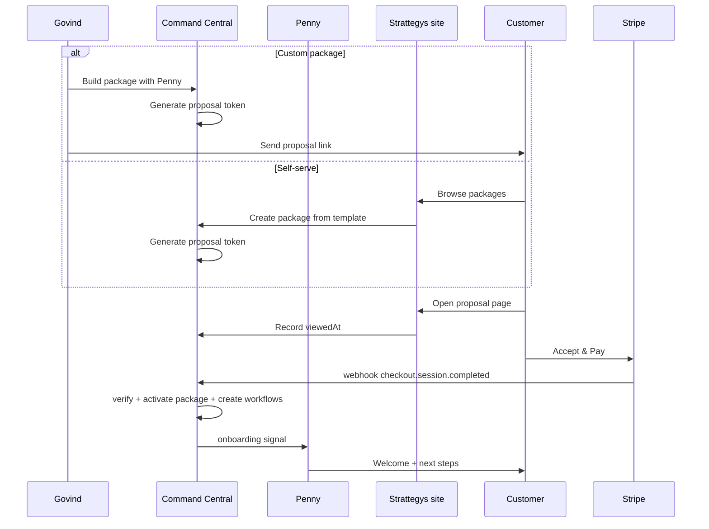

# Phase 1 — operational readiness plan

> Single consolidated plan for reaching phase 1: every agent performing daily tasks, packages as the sellable unit, accounts as the business relationship, configuration-first automation.
>
> **Companion docs:**
>
> - `[AGENTS.md](../AGENTS.md)` — Cursor/Composer project memory: plan pointer, **ntfy human alerts** (`cursor_builder`), security note
> - `[docs/PHASE-1-HUMAN-TEST-CHECKLIST.md](PHASE-1-HUMAN-TEST-CHECKLIST.md)` — **manual verification checklist** after P0/P1 work
> - `[docs/PENNY-PACKAGE-SALES-PLAN.md](PENNY-PACKAGE-SALES-PLAN.md)` — Penny workspace wireframes, account data model detail, product board design
> - `[docs/AGENT_UI_ARCHITECTURE.md](AGENT_UI_ARCHITECTURE.md)` — UI routing, panel architecture, tab patterns

---

## Task tracker


| ID                                 | Task                                                                                             | Priority | Status  |
| ---------------------------------- | ------------------------------------------------------------------------------------------------ | -------- | ------- |
| `platform-env-crm`                 | Validate env + CRM connectivity (check-crm-db, system-status) on target runtime                  | P0       | Pending |
| `p0-friday-crons`                  | Verify hosted Friday crons + heartbeats; packages ACTIVE with correct spec                       | P0       | Pending |
| `p0-tim-suzi`                      | Tim queue draft->submit path + Suzi reminder/punch smoke tests                                   | P0       | Pending |
| `p0-penny-package-sales`           | Penny/Friday: repeatable sales path; `spec.commercial` + gate on submit/approve/activate         | P0       | Pending |
| `p0-penny-workspace`               | Penny workspace: shell routing + `PennyWorkPanel` + Accounts tab + Pipeline tab                  | P0       | Pending |
| `p0-penny-accounts-api`            | New `GET /api/penny/accounts` endpoint — company + package aggregation + lead detection          | P0       | Pending |
| `p0-penny-account-convention`      | Update `package_manager` tool + `FridayPackageBuilderModal` for `customerType: 'company'`        | P0       | Pending |
| `p0-king-cost-summary-wire`        | Register `cost_summary` in ToolId, TOOL_REGISTRY, King tools; align prompt/registry              | P0       | Pending |
| `p0-package-spec-marni-cadence`    | Marni: package spec block + workflow mirroring warmOutreachDiscovery                             | P0       | Pending |
| `p0-scout-targeting-data`          | Scout: staleness = edit `spec.scoutTargeting` / brief; optional human check-in flow              | P0       | Pending |
| `p0-ghost-package-or-generic-cron` | Ghost: package-tied cadence or one generic package/workflow-driven LLM tick                      | P0       | Pending |
| `p0-king-package-margin`           | King: attribute usage with `packageId`; per-package margin (revenue from spec vs `_usage_event`) | P0       | Pending |
| `p1-penny-health-tab`              | Penny Health tab: delivery satisfaction dashboard with client-side health scoring                | P1       | Pending |
| `p1-penny-products-tab`            | Penny Products tab: product board from extended `PackageTemplateSpec`                            | P1       | Pending |
| `p1-penny-onboarding`              | Penny onboarding flow: welcome sequence + intake on package activation (account-level)           | P1       | Pending |
| `p1-proposal-page`                 | Proposal page on Strattegys site: public package review + "Accept & Pay" via Stripe Checkout     | P1       | Pending |
| `p1-proposal-token`               | `spec.proposal` fields + token generation + link sharing in tool / UI                            | P1       | Pending |
| `p1-stripe-webhook`               | Stripe webhook -> idempotent activate package + CRM company from customer email                  | P1       | Pending |
| `p1-penny-post-acceptance`        | Penny: thank-you + onboarding playbook triggered on package acceptance                           | P1       | Pending |
| `p1-friday-health-heartbeat`       | Friday heartbeat: package health check (compare workflow progress vs `targetCount`)              | P1       | Pending |
| `p0-web-push`                      | Web Push notifications: VAPID keys, SW push handler, subscription API, send on human-gate events | P0       | Pending |
| `p0-tim-dashboard`                 | Tim: real dashboard (throughput goals, queue depth, follow-ups, inbound) replacing placeholder    | P0       | Pending |
| `p0-ghost-dashboard`               | Ghost: real dashboard (content pipeline stats, queue depth) + Board tab                          | P0       | Pending |
| `p0-marni-dashboard`               | Marni: real dashboard (distribution metrics, KB cadence, influencer engagement)                   | P0       | Pending |
| `p0-scout-dashboard`               | Scout: real dashboard (campaign summary, targeting diversity, funnel totals)                      | P0       | Pending |
| `p0-king-dashboard`                | King: real dashboard (cost overview, agent breakdown, budget tracking)                            | P0       | Pending |
| `p0-penny-dashboard`               | Penny: full workspace rebuild — Accounts, Pipeline, Products tabs replacing placeholder          | P0       | Pending |
| `p2-penny-lifecycle`               | Client communication, satisfaction check-ins, close-out, renewal/upsell                          | P2       | Pending |
| `p2-outbound-email`                | Outbound email tool (Postmark) for account updates                                               | P2       | Pending |
| `p2-king-invoicing`                | King: per-account P&L, invoicing                                                                 | P2       | Pending |
| `p2-tim-converted-signal`          | Tim: `CONVERTED` stage signal back to Penny/King                                                 | P2       | Pending |
| `docs-model-readme`                | Align README and MODEL_GUIDE with Groq-default agent-registry reality                            | P1       | Pending |


---

## Configuration-first principle

**Manage work through:**

1. `**WORKFLOW_TYPES`** in `[web/lib/workflow-types.ts](../web/lib/workflow-types.ts)` — board stages, `throughputGoal` for Friday Goals, human-action copy.
2. **Packages** — `[web/lib/package-types.ts](../web/lib/package-types.ts)` `PackageSpec`: `deliverables[]` (workflow type + `ownerAgent` + `targetCount` + optional `pacing`, `stageNotes`, `blockedBy`, `stopWhen`), plus `brief`, `scoutTargeting`, `warmOutreachDiscovery`, and **planned** `commercial`.
3. **Activation** — Approving a package creates `_workflow` + `_board` from templates (`[package-manager.ts](../web/lib/tools/package-manager.ts)`, `[packages/activate](../web/app/api/crm/packages/activate/route.ts)`).

**Minimize new code** by extending `PackageSpec` with optional JSON, reusing `[warm-outreach-discovery.ts](../web/lib/warm-outreach-discovery.ts)` patterns, and editing package data before adding new workflow types or crons.

---

## The account model

An **account** is a `company` row in the CRM. It is the fundamental business unit — both for pre-package sales tracking and for package delivery management.

### Why accounts

1. **Pre-package:** An account can be a **lead** (Tim/Scout have engaged people at that company) before any package exists.
2. **Package delivery:** Packages are sold **to accounts** (`_package.customerId` -> `company.id`, `customerType: 'company'`). People at the account are **contacts**.
3. **Lifecycle:** Health, revenue, satisfaction, and renewal tracking are all at the account level.

### Data model mapping (zero schema changes)


| Concept            | Existing structure                                   | Convention change needed                                        |
| ------------------ | ---------------------------------------------------- | --------------------------------------------------------------- |
| Account            | `company` table (Twenty CRM)                         | None — already exists                                           |
| Account contacts   | `person.companyId` -> `company.id`                   | None — already linked                                           |
| Package -> Account | `_package.customerId` + `customerType`               | Use `customerType: 'company'` (today UI defaults to `'person'`) |
| Lead detection     | `person` in Tim/Scout workflows + `person.companyId` | Derive: company has people in outreach but no package yet       |
| Account stage      | Not stored                                           | **Derived** from aggregate package/workflow state               |


### Derived account stage (no new columns)


| Stage         | Derivation                                                             | Priority   |
| ------------- | ---------------------------------------------------------------------- | ---------- |
| **Lead**      | Company has people in outreach workflows, no `_package` linked         | 1 (lowest) |
| **Prospect**  | Company has people in reply-to-close (active conversation), no package | 2          |
| **Proposal**  | Company has at least one `DRAFT` package                               | 3          |
| **Review**    | Company has at least one `PENDING_APPROVAL` package                    | 4          |
| **Customer**  | Company has at least one `ACTIVE` package                              | 5          |
| **Delivered** | Company has only `COMPLETED` packages                                  | 6          |


Highest active stage wins.

### Convention changes required

1. `**FridayPackageBuilderModal.tsx`** — offer company selection (not just person). Currently hardcodes `customerType: "person"`.
2. `**package_manager` tool** — Penny's prompt should prefer company-level linking. Tool already documents `person|company` as valid.
3. `**agents/penny/system-prompt.md`** — instruct Penny to think in terms of accounts.
4. **Tim's outreach** — no change needed. People in outreach already have `companyId`; the accounts API detects leads from this.

---

## Per-agent plan

### Friday — ops hub

**Role:** Platform administration, cron management, package/workflow template authoring, Goals dashboard.

**P0 tasks:**

- Verify hosted crons + heartbeats (`p0-friday-crons`)
- Ensure packages ACTIVE with correct spec
- Goals dashboard shows throughput per workflow type

**P1 tasks:**

- Package health heartbeat: compare workflow progress vs `targetCount` per deliverable (`p1-friday-health-heartbeat`)
- Surface alerts to Penny when packages fall behind

**Key files:** `web/components/friday/FridayDashboardPanel.tsx`, `web/lib/cron.ts`, `web/lib/heartbeat.ts`

---

### Penny — client success agent

**Role:** Account lifecycle from lead through delivery, satisfaction, close-out, and renewal. Owns the customer relationship.

#### P0: Dashboard rebuild + workspace + sales path + commercial

**Dashboard** (`p0-penny-dashboard`): Full workspace rebuild — replace placeholder and Friday redirect with real `PennyWorkspacePanel` containing Accounts, Pipeline, and Products tabs. Health tab is P1.

**Penny's workspace — `PennyWorkPanel`** (4 tabs):


| Tab                    | Purpose                  | Layout                                                                                        |
| ---------------------- | ------------------------ | --------------------------------------------------------------------------------------------- |
| **Accounts** (default) | Account relationship hub | Master-detail: account list (left) + account detail with contacts, packages, progress (right) |
| **Pipeline**           | Account sales funnel     | Kanban: Lead -> Proposal -> Review -> Customer -> Delivered (cards = accounts)                |
| **Health**             | Delivery satisfaction    | Summary stats + per-account health cards sorted worst-first                                   |
| **Products**           | Product development      | Card grid of package templates with status (Idea -> Published)                                |


**Shell routing:** New `CommandCentralRightPanel` value `"penny-work"`. Default panel for Penny changes from `"info"` to `"penny-work"`. URL: `?agent=penny&panel=penny-work&pennySub=accounts`.

**New API:** `GET /api/penny/accounts` — joins `company` -> `_package` (where `customerType = 'company'`) + `person` -> `_workflow_item` for lead detection. Returns: company info, derived stage, package counts by stage, contact count, revenue.

**Sales path (repeatable):**


| Step                | Surface                         | Mechanism                                                             |
| ------------------- | ------------------------------- | --------------------------------------------------------------------- |
| Draft               | Penny chat or Friday Planner    | `create-package` with `customerType: 'company'`                       |
| Account link        | Penny selects company           | `customerId` -> `company.id`                                          |
| Submit              | Penny / Govind                  | `submit-for-approval` -> `PENDING_APPROVAL`                           |
| Approve + workflows | Govind says **approve package** | `approve-package` -> boards + workflows -> `ACTIVE`                   |
| Go live (UI)        | Package card                    | `POST /api/crm/packages/activate` -> `ACTIVE` + tasks to owner agents |


**`spec.commercial` and `spec.source`** — new optional fields on `PackageSpec`:

| Field | Shape | Purpose |
|-------|-------|---------|
| `commercial.contractPriceUsd` | `number` | Agreed price for the engagement |
| `commercial.currency` | `string` (default `'USD'`) | Currency code |
| `commercial.billingType` | `'one-time' \| 'monthly' \| 'milestone' \| 'custom'` | How the account is billed |
| `commercial.billingNotes` | `string` (optional) | Free text for custom terms (e.g. "Net 30", "50% upfront") |
| `commercial.internalCostBudgetUsd` | `number` (optional) | Internal budget ceiling for King margin tracking |
| `source.type` | `'manual' \| 'stripe'` | How the package originated |
| `source.sessionId` | `string` (optional) | Stripe session ID (self-serve only) |
| `source.referral` | `string` (optional) | Who referred the account (manual only) |
| `source.notes` | `string` (optional) | Context on how the deal came in |

Gate: require `contractPriceUsd` (or explicit waiver) before submit-for-approval.

#### Unified customer experience: the proposal page

Every package — custom or pre-built — goes through the same customer-facing acceptance step. The only difference is what happens *before* the customer sees the link.

```
  Custom deal                     Self-serve browse
       |                                |
  Govind talks to customer         Customer finds package
  Penny builds custom package      on Strattegys site
       |                                |
       +---------- both lead to --------+
                      |
              Proposal page (public)
              - Package name + description
              - Deliverables with timeline
              - Price + billing terms
              - "Accept & Pay" (Stripe)
                      |
              Customer accepts + pays
                      |
              Package -> ACTIVE
              Penny -> onboarding
```

**Two origination paths, one acceptance experience:**

| Path | Before the link | Source |
|------|----------------|--------|
| **Custom** | Govind talks to the customer, Penny builds a bespoke package, then sends them the proposal link to review and accept | `source.type: 'manual'` |
| **Self-serve** | Customer browses Strattegys site, selects a pre-built package, lands on the same proposal page | `source.type: 'self-serve'` |

**Proposal page design:**

- **URL:** Hosted on Strattegys site. E.g. `strattegys.com/proposal/[token]`
- **Access:** Signed token (not raw package UUID). Generated when Penny/Govind is ready to share. Stored as `spec.proposal.token`.
- **Content:** Package name, description (`spec.brief`), deliverables table (what's included, who delivers, volume, timeline), price and billing terms (`spec.commercial`), "Accept & Pay" button -> Stripe Checkout.
- **On acceptance:** Stripe Checkout completes -> webhook moves package to ACTIVE -> workflows created -> Penny gets onboarding signal.
- **For manual billing:** "Accept" button (no Stripe) -> direct stage transition. Billing handled separately via invoice.

**Proposal spec fields:**

| Field | Shape | Purpose |
|-------|-------|---------|
| `proposal.token` | `string` | URL-safe token for the public link |
| `proposal.sentAt` | `string` (ISO) | When the link was shared with the customer |
| `proposal.viewedAt` | `string` (ISO, optional) | First time the customer opened the page |
| `proposal.acceptedAt` | `string` (ISO, optional) | When the customer accepted |

**Custom path walkthrough:**

1. Govind has a conversation with a potential client
2. Tells Penny: "Build a custom package for Acme Corp — 50 outreach targets, 4 articles, 3 months, $5,000"
3. Penny creates the package with custom deliverables and `spec.commercial`
4. Penny generates a proposal link (via tool or UI button on the package card)
5. Govind sends the link: "Here's what we discussed — take a look and accept when ready"
6. Customer opens `strattegys.com/proposal/abc123`, reviews deliverables and price
7. Customer clicks "Accept & Pay" -> Stripe Checkout -> payment confirmed
8. Package activates, Penny sends welcome/onboarding

**Self-serve path walkthrough:**

1. Customer browses `strattegys.com/packages/spotlight`
2. Clicks "Get started" -> same proposal page with pre-built Spotlight deliverables and price
3. Customer clicks "Accept & Pay" -> Stripe Checkout -> payment confirmed
4. Package activates, Penny sends welcome/onboarding

**Chat context:** `formatPennyWorkPanelContext` injects account/pipeline/health context into LLM chat (follows Suzi's `formatSuziWorkPanelContext` pattern).

> Full wireframes, data sources, and component architecture: [`docs/PENNY-PACKAGE-SALES-PLAN.md`](PENNY-PACKAGE-SALES-PLAN.md)

#### P1: Health + Products + onboarding + proposal page

- **Health tab:** Client-side health scoring (progress vs pace from `targetCount` + `pacing`). Account health = worst package health.
- **Products tab:** Extended `PackageTemplateSpec` with `productStage` field (Option A — config-only, no new tables).
- **Onboarding:** Welcome sequence + intake questionnaire on package activation (account-level).
- **Proposal page:** Public-facing package review + acceptance page on Strattegys site (shared by both custom and self-serve paths).

#### P2: Full lifecycle

- Client communication: status report generation per account
- Satisfaction check-ins: cadence-driven prompts
- Close-out: automated delivery summary + `COMPLETED` transition
- Renewal/upsell: "What's next?" flow when account's packages near completion

**Key files:** `web/components/penny/`, `web/lib/tools/package-manager.ts`, `agents/penny/system-prompt.md`

---

### Tim — warm outreach

**Role:** LinkedIn outreach, conversation management, work queue.

**P0 tasks:**

- **Dashboard** (`p0-tim-dashboard`): Replace placeholder with real `TimDashboardPanel` — throughput goals filtered to Tim's workflows, queue depth, follow-up count, inbound messages, warm outreach daily progress
- Package-driven warm outreach via `spec.warmOutreachDiscovery` + `[warm-outreach-discovery.ts](../web/lib/warm-outreach-discovery.ts)`
- Queue draft -> submit path working (`p0-tim-suzi`)
- `throughputGoal` on `linkedin-opener-sequence` visible in Friday Goals

**P2 tasks:**

- Structured `CONVERTED` signal back from `reply-to-close` to Penny/King (`p2-tim-converted-signal`). The `CONVERTED` stage exists but nothing flows from there.

**Key files:** `web/components/tim/TimAgentPanel.tsx`, `web/components/tim/TimDashboardPanel.tsx` (new), `web/lib/warm-outreach-discovery.ts`

---

### Scout — research + targeting

**Role:** Find prospects, enrich, qualify, hand to Tim. Mostly automated.

**P0 tasks:**

- **Dashboard** (`p0-scout-dashboard`): Replace placeholder with real `ScoutDashboardPanel` — campaign summary (active count, pipeline total, handed off, new today), daily goal pace, per-campaign mini cards
- `scout-daily-research` + `research-pipeline` from deliverables
- Refresh ICP via `spec.scoutTargeting` (data first, not new code)
- **Human check-in flow:** ~5 fresh target audience suggestions to avoid stale ICP. Scout-initiated cadence prompt or Friday-managed reminder.

**Key files:** `web/components/scout/ScoutCampaignPanel.tsx`, `web/components/scout/ScoutDashboardPanel.tsx` (new), `web/lib/cron.ts` (scout-daily-research handler), `agents/scout/system-prompt.md`

---

### Marni — content + influencer cadence

**Role:** Content repurposing, LinkedIn posts, influencer engagement.

**P0 tasks:**

- **Dashboard** (`p0-marni-dashboard`): Replace placeholder with real `MarniDashboardPanel` — distribution throughput, KB topic count, influencer cadence progress, queue depth
- Package-spec cadence parallel to `warmOutreachDiscovery` (configuration-first)
- Influencer engagement: ~5x/day reminder-driven manual process. You paste URL, Marni stores it and downstream delegates to Scout/Tim.
- `throughputGoal` on Marni's workflow type -> Friday Goals
- Marni workflow mirrors Tim's Warm Outreach pattern with `throughputGoal` for visibility

**Key files:** `web/components/marni/MarniWorkPanel.tsx`, `web/components/marni/MarniDashboardPanel.tsx` (new), `agents/marni/system-prompt.md`

---

### Ghost — content pipeline

**Role:** Research topics, write articles, publish to site.

**P0 tasks:**

- **Dashboard** (`p0-ghost-dashboard`): Replace placeholder with real `GhostDashboardPanel` — content throughput, queue depth, content stage distribution, recent articles. Add **Board** tab (`KanbanInlinePanel` matching Marni's pattern).
- Package with `content-pipeline` deliverable + `brief`
- Prefer one generic DB-aware LLM tick over hardcoded campaign copy
- Daily topic research + recommendation cycle

**Key files:** `web/components/ghost/GhostAgentPanel.tsx`, `web/components/ghost/GhostDashboardPanel.tsx` (new), `agents/ghost/system-prompt.md`

---

### Suzi — personal assistant

**Role:** Personal assistant only. Reminders, punch list, notes, intake. **No involvement in accounts, packages, or delivery management** — those are Penny's domain.

**P0 tasks:**

- Heartbeat reminders working (`p0-tim-suzi`)
- Intake flow for mobile share/URL submission
- Punch list and notes functional

**Key files:** `web/components/suzi/SuziRemindersPanel.tsx`, `web/lib/suzi-work-panel.ts`

---

### King — cost + margin

**Role:** Cost tracking, usage monitoring, package margin.

**P0 tasks:**

- **Dashboard** (`p0-king-dashboard`): Replace placeholder with real `KingDashboardPanel` — headline cost metrics (7-day spend, event count, token usage), agent breakdown bar, 30-day trend, fixed costs
- **Step 1:** Register `cost_summary` in `ToolId`, `TOOL_REGISTRY`, and King agent tools (`p0-king-cost-summary-wire`). Prereq for everything else.
- **Step 2:** `spec.commercial` on packages (shared with Penny). Thread `packageId` into `recordUsageEvent` / `logCommandCentralLlmUsage` when context is a packaged workflow.
- **Step 3:** Per-package summary: revenue from `spec.commercial.contractPriceUsd`, cost from `_usage_event` rows with matching `packageId`. Margin = revenue - cost. Extend `/api/costs/summary` or sibling route. Wire into `KingCostPanel` (second tab or inline).

**P2 tasks:**

- Per-account P&L (aggregate packages per company)
- Invoicing / collections
- Revenue recognition

**Key files:** `web/lib/tools/cost-summary.ts`, `web/components/king/KingCostPanel.tsx`, `web/components/king/KingDashboardPanel.tsx` (new), `web/lib/usage-events.ts`

---

## Package acceptance: the proposal page

Both custom and self-serve packages converge on a **single customer-facing proposal page** on the Strattegys site. The customer reviews what they're getting, the price, and accepts — regardless of how the package was created.

### How packages reach the proposal page

| Path | What happens before | Who creates the package |
|------|-------------------|------------------------|
| **Custom** | Govind talks to the customer, Penny builds a bespoke package in Command Central, then generates a proposal link | Penny / Govind |
| **Self-serve** | Customer browses Strattegys site, selects a pre-built package, arrives at the same proposal page | Auto-created from template |

### Proposal page (Strattegys site)

**URL:** `strattegys.com/proposal/[token]`

**Access:** Signed token (not raw package UUID). Generated when the package is ready to share. Stored as `spec.proposal.token`.

**Page content:**
- Company branding
- Package name and description (from `spec.brief`)
- Deliverables table: what's included, who delivers, volume, timeline
- Price and billing terms (from `spec.commercial`)
- "Accept & Pay" button -> Stripe Checkout
- "Accept" button -> for packages billed separately (e.g. invoiced)

### Acceptance flow



### What happens on acceptance

| Event | Action |
|-------|--------|
| Customer views page | Record `spec.proposal.viewedAt` |
| "Accept & Pay" | Stripe Checkout -> on success, webhook activates package |
| "Accept" (manual billing) | Direct stage transition to ACTIVE (or APPROVED if review gate on) |
| Package activates | Workflows created, owner agents tasked, Penny gets onboarding signal |

### Implementation details

**Proposal spec fields:**

| Field | Shape | Purpose |
|-------|-------|---------|
| `proposal.token` | `string` | URL-safe token for the public link |
| `proposal.sentAt` | `string` (ISO) | When the link was shared |
| `proposal.viewedAt` | `string` (ISO, optional) | First time customer opened the page |
| `proposal.acceptedAt` | `string` (ISO, optional) | When the customer accepted |

**Stripe integration:**
- Proposal page creates a Stripe Checkout Session with package metadata (`packageId`, `token`)
- Webhook `checkout.session.completed` -> verify signature -> idempotent activate
- `spec.source` records: `{ type: 'manual' | 'self-serve', stripeSessionId: '...' }`
- **Env:** `STRIPE_SECRET_KEY`, `STRIPE_WEBHOOK_SECRET`, `NEXT_PUBLIC_STRIPE_PUBLISHABLE_KEY`

**Penny's role:**
- Generates proposal links (via `package_manager` tool or UI button on package card)
- Tracks viewed/accepted status (visible in Accounts tab and Pipeline)
- Sends thank-you + onboarding on acceptance
- Prompt extended for post-acceptance behavior


---

## Strategic business function coverage

Mapping of core business functions to agent coverage:


| Function                  | Agent(s)                                    | Status                       |
| ------------------------- | ------------------------------------------- | ---------------------------- |
| Lead generation           | Scout, Tim                                  | Covered                      |
| Content creation          | Ghost                                       | Covered                      |
| Content distribution      | Marni                                       | Covered                      |
| Outreach / LinkedIn       | Tim                                         | Covered                      |
| Influencer engagement     | Marni                                       | P0 (manual + reminders)      |
| **Product development**   | **Penny** (Products tab)                    | **P1 — new**                 |
| Custom package sales      | Penny, Friday                               | Covered (P0 adds commercial + source) |
| **Self-serve sales**      | **Penny + Stripe**                          | **P1 — new**                 |
| **Client onboarding**     | **Penny**                                   | **P1 — new**                 |
| **Delivery tracking**     | **Penny** (Health tab) + Friday (heartbeat) | **P0/P1 — new**              |
| **Client communication**  | **Penny**                                   | **P2 — new**                 |
| **Customer satisfaction** | **Penny** (Health tab)                      | **P1 — new**                 |
| **Package close-out**     | **Penny**                                   | **P2 — new**                 |
| **Renewal / upsell**      | **Penny**                                   | **P2 — new**                 |
| Cost tracking             | King                                        | Covered                      |
| **Package margin**        | **King**                                    | **P0 — new**                 |
| **Per-account P&L**       | **King**                                    | **P2 — new**                 |
| **Invoicing**             | **King**                                    | **P2 — new**                 |
| Personal ops              | Suzi                                        | Covered                      |
| Platform / admin          | Friday                                      | Covered                      |


### Gaps requiring new tools


| Gap                   | Tool needed                              | Priority |
| --------------------- | ---------------------------------------- | -------- |
| Client email updates  | Outbound email (Postmark)                | P2       |
| Tim conversion signal | `CONVERTED` workflow event -> Penny/King | P2       |
| Calendar scheduling   | Calendar integration for client calls    | P2+      |


---

## Agent dashboard specifications (P0)

Every agent gets a real dashboard as its first tab — no more placeholders. The goal is to frame the complete house: each agent's workspace shows real data from existing APIs, with the right tabs wired for their function.

### Current state

| Agent | Dashboard | Working Tabs | Status |
|-------|-----------|-------------|--------|
| **Suzi** | Real (`SuziPersonalDashboardPanel`) | Dashboard, Punch list, Reminders, Notes, Intake | **Done** — no work needed |
| **Friday** | Real (`FridayDashboardPanel`) | Goals, Package Kanban, WF Templates, Tools, Architecture, Cron | **Done** — no work needed |
| **Tim** | Placeholder | Work Queue, CRM | **Needs real dashboard** |
| **Ghost** | Placeholder | Work Queue | **Needs real dashboard + Board tab** |
| **Marni** | Placeholder | Work Queue, Board | **Needs real dashboard** |
| **Scout** | Placeholder | Campaign Throughput | **Needs real dashboard** |
| **King** | Placeholder | Cost Usage | **Needs real dashboard** |
| **Penny** | Placeholder | Package Kanban (redirect to Friday) | **Needs full workspace rebuild** |

### Tim dashboard (`p0-tim-dashboard`)

**File:** `web/components/tim/TimDashboardPanel.tsx` (new) — replace `AgentPlaceholderDashboard` in `TimAgentPanel.tsx`.

**Tabs after:** Dashboard, Work Queue, CRM (unchanged tab list, dashboard becomes real).

**Data sources:**
- `GET /api/crm/workflow-throughput` — filter to Tim's workflow types (`linkedin-opener-sequence`, `warm-outreach`, `reply-to-close`)
- `GET /api/crm/human-tasks?ownerAgent=tim&summary=1` — fast polling for queue count, follow-up count, inbound message count, warm outreach daily progress

**Dashboard layout:**
```
┌─────────────────────────────────────────────────────┐
│  Tim — Outreach overview                            │
├────────────┬───────────┬────────────┬───────────────┤
│ Queue      │ Follow-ups│ Inbound    │ Warm outreach │
│ depth: 12  │ due: 3    │ msgs: 5   │ today: 4/10   │
├────────────┴───────────┴────────────┴───────────────┤
│  Goals                                              │
│  ┌──────────────────┐ ┌──────────────────┐         │
│  │ LinkedIn Opener   │ │ Warm Outreach    │         │
│  │ 7/10 daily  ████░│ │ 4/5 daily  ████░ │         │
│  │ On pace           │ │ Behind           │         │
│  └──────────────────┘ └──────────────────┘         │
│  Measured throughput                                │
│  ┌──────────────────┐                              │
│  │ Reply to Close    │                              │
│  │ 2 today           │                              │
│  └──────────────────┘                              │
└─────────────────────────────────────────────────────┘
```

### Ghost dashboard (`p0-ghost-dashboard`)

**File:** `web/components/ghost/GhostDashboardPanel.tsx` (new) — replace placeholder in `GhostAgentPanel.tsx`.

**Tabs after:** Dashboard, Work Queue, **Board** (new — `KanbanInlinePanel` for Ghost, matching Marni's pattern).

**Data sources:**
- `GET /api/crm/workflow-throughput` — filter to Ghost's workflow types (`content-pipeline`)
- `GET /api/crm/human-tasks?ownerAgent=ghost&sourceType=content&summary=1` — content queue count
- `GET /api/crm/workflow-items?agentId=ghost` — content item stage distribution

**Dashboard layout:**
```
┌─────────────────────────────────────────────────────┐
│  Ghost — Content pipeline                           │
├────────────┬───────────┬────────────┬───────────────┤
│ Queue      │ Ideas     │ In draft   │ Published     │
│ depth: 4   │ 8         │ 3          │ 12            │
├────────────┴───────────┴────────────┴───────────────┤
│  Goals                                              │
│  ┌──────────────────┐                              │
│  │ Content Pipeline  │                              │
│  │ 1/2 weekly  ██░░░│                              │
│  │ On pace           │                              │
│  └──────────────────┘                              │
│  Recent content                                     │
│  · "AI for Small Business" — PUBLISHED (Apr 1)     │
│  · "LinkedIn Automation" — IN_DRAFT (Mar 28)       │
│  · "Market Research Guide" — IDEA (Mar 25)         │
└─────────────────────────────────────────────────────┘
```

### Marni dashboard (`p0-marni-dashboard`)

**File:** `web/components/marni/MarniDashboardPanel.tsx` (new) — replace placeholder in `MarniWorkPanel.tsx`.

**Tabs after:** Dashboard, Work Queue, Board (unchanged tab list, dashboard becomes real).

**Data sources:**
- `GET /api/crm/workflow-throughput` — filter to Marni's workflow types (`content-distribution`, any influencer cadence type)
- `GET /api/crm/human-tasks?ownerAgent=marni&distributionOnly=1&summary=1` — distribution queue count
- `GET /api/marni-kb/topics` — KB topic count / cadence health

**Dashboard layout:**
```
┌─────────────────────────────────────────────────────┐
│  Marni — Content & engagement                       │
├────────────┬───────────┬────────────┬───────────────┤
│ Queue      │ KB topics │ Posts this │ Influencer    │
│ depth: 6   │ 24        │ week: 5    │ engages: 3/5  │
├────────────┴───────────┴────────────┴───────────────┤
│  Goals                                              │
│  ┌──────────────────┐ ┌──────────────────┐         │
│  │ Content Distrib.  │ │ Influencer Cadence│         │
│  │ 3/5 daily  ███░░ │ │ 3/5 daily  ███░░  │         │
│  └──────────────────┘ └──────────────────┘         │
│  KB cadence health                                  │
│  · Last research run: 2h ago                       │
│  · Topics needing refresh: 3                        │
└─────────────────────────────────────────────────────┘
```

### Scout dashboard (`p0-scout-dashboard`)

**File:** `web/components/scout/ScoutDashboardPanel.tsx` (new) — replace placeholder in `ScoutCampaignPanel.tsx`.

**Tabs after:** Dashboard, Campaign Throughput (unchanged tab list, dashboard becomes real).

**Data sources:**
- `GET /api/crm/scout-queue` — already returns full campaign summary with funnel counts, daily goals, 24h items, pipeline totals
- No additional API needed — scout-queue provides everything

**Dashboard layout:**
```
┌─────────────────────────────────────────────────────┐
│  Scout — Research overview                          │
├────────────┬───────────┬────────────┬───────────────┤
│ Campaigns  │ In pipe-  │ Handed off │ New today     │
│ active: 3  │ line: 47  │ total: 85  │ +12           │
├────────────┴───────────┴────────────┴───────────────┤
│  Daily goal pace                                    │
│  Sum of daily goals: 15/day                         │
│  New items (24h): 12  ████████████░░░  (80%)       │
│                                                     │
│  Campaign summary                                   │
│  ┌──────────────────┐ ┌──────────────────┐         │
│  │ Spotlight — Acme  │ │ Growth — TechCo  │         │
│  │ 34% to target    │ │ 67% to target    │         │
│  │ ██░░░ 3/day goal │ │ ████░ 5/day goal │         │
│  └──────────────────┘ └──────────────────┘         │
└─────────────────────────────────────────────────────┘
```

### King dashboard (`p0-king-dashboard`)

**File:** `web/components/king/KingDashboardPanel.tsx` (new) — replace placeholder in `KingCostPanel.tsx`.

**Tabs after:** Dashboard, Cost Usage (unchanged tab list, dashboard becomes real).

**Data sources:**
- `GET /api/costs/summary?days=7` — headline metrics (events, tokens, estimated USD)
- Same API, different `days` params for trend comparison (7-day vs 30-day)

**Dashboard layout:**
```
┌─────────────────────────────────────────────────────┐
│  King — Cost overview                               │
├────────────┬───────────┬────────────┬───────────────┤
│ Est. cost  │ Events    │ Input      │ Output        │
│ $2.47 (7d) │ 1,234     │ tokens 45K │ tokens 12K   │
├────────────┴───────────┴────────────┴───────────────┤
│  Agent breakdown (7d)                               │
│  Tim ·········· $1.05  ████████░░░░░░              │
│  Scout ········ $0.62  █████░░░░░░░░               │
│  Ghost ········ $0.41  ███░░░░░░░░░░               │
│  Marni ········ $0.22  ██░░░░░░░░░░░               │
│  Suzi ········· $0.17  █░░░░░░░░░░░░               │
│                                                     │
│  30-day trend: $8.52 total                          │
│  Fixed costs: Unipile $29/mo                        │
└─────────────────────────────────────────────────────┘
```

### Penny workspace rebuild (`p0-penny-dashboard`)

**File:** `web/components/penny/PennyWorkspacePanel.tsx` (rewrite) — full workspace with 3 P0 tabs + 1 P1 tab.

**Tabs after:** **Accounts** (default), **Pipeline**, **Products**, Health (P1).

**Data sources:**
- `GET /api/penny/accounts` (new endpoint — `p0-penny-accounts-api`) — company + package aggregation + lead detection
- `GET /api/crm/packages?stage=ACTIVE` — package list for Pipeline
- `GET /api/crm/directory/companies` — company data for Accounts
- Package templates from `web/lib/package-types.ts` — for Products tab

**New components:**
- `PennyAccountsPanel.tsx` — master-detail account list
- `PennyAccountDetailCard.tsx` — account detail with contacts, packages, progress
- `PennyPipelinePanel.tsx` — kanban-like view of accounts by derived stage
- `PennyProductsPanel.tsx` — card grid of package templates with product stage

> Full wireframes and data model: [`docs/PENNY-PACKAGE-SALES-PLAN.md`](PENNY-PACKAGE-SALES-PLAN.md)

### Implementation approach

All six dashboards follow the same pattern:
1. Create a new `[Agent]DashboardPanel.tsx` component that fetches from existing APIs
2. Replace the `AgentPlaceholderDashboard` import in the parent panel with the new dashboard
3. Add any missing tabs (Ghost Board, Penny full rebuild)
4. No new API endpoints needed except for Penny (`GET /api/penny/accounts`)

Shared UI patterns across dashboards:
- **Stat cards** — 2x2 or 4-column grid for headline metrics
- **Goal cards** — throughput progress bars with status badges (reuse from `FridayGoalsPanel` pattern)
- **Section titles** — 10px uppercase tracking-wide labels
- **Card shells** — rounded-lg border bg-secondary/40 containers

---

## Recommended implementation order

### Phase 1 — P0 (core operations)

```
 1. Platform           Validate env + CRM connectivity
 2. Friday crons       Verify hosted crons + heartbeats
 3. Tim + Suzi         Queue draft->submit + reminder smoke tests
 4. Agent dashboards   All 6 placeholder dashboards replaced with real UIs:
                        a. Tim dashboard      — throughput goals + queue stats
                        b. Ghost dashboard    — content pipeline + Board tab
                        c. Marni dashboard    — distribution metrics + KB cadence
                        d. Scout dashboard    — campaign summary from scout-queue
                        e. King dashboard     — cost overview from costs/summary
                        f. Penny workspace    — full rebuild: Accounts, Pipeline, Products
 5. Penny accounts API GET /api/penny/accounts endpoint
 6. Account convention customerType: 'company' in tool + UI
 7. Commercial         spec.commercial + gate on stage transitions
 8. Web Push           VAPID keys + SW push handler + subscription API
 9. King wiring        cost_summary registration + packageId attribution
10. King margin        Per-package revenue vs cost
11. Scout/Marni/Ghost  Spec-driven cadence, minimal new crons
```

### Phase 2 — P1 (delivery + products + Stripe)

```
12. Penny Health     Delivery satisfaction dashboard
13. Penny Products   Product board (extended PackageTemplateSpec)
14. Penny onboarding Welcome sequence on activation
15. Friday heartbeat Package health alerts
16. Proposal page    Public package review + accept page on Strattegys
17. Proposal tokens  spec.proposal fields + token gen + link sharing
18. Stripe webhook   Verified webhook -> activate on acceptance
19. Penny post-accept Thank-you + onboarding on package acceptance
```

### Phase 3 — P2 (full lifecycle)

```
20. Client comms     Status reports per account
21. Satisfaction     Check-in cadence + feedback capture
22. Close-out        Delivery summary + COMPLETED transition
23. Renewal/upsell   "What's next?" flow
24. Outbound email   Postmark tool
25. King invoicing   Per-account P&L + invoicing
26. Tim converted    CONVERTED signal to Penny/King
```

---

## Mobile notifications — Web Push (P0)

When agents need human approval (package sign-off, outreach drafts, quality checks), you need to know even when you're away from the desk. The PWA infrastructure is already in place — this is the last mile.

### What exists today

| Piece | Status |
|-------|--------|
| PWA manifest (`app/manifest.ts`) | Exists — `standalone`, icons, share target |
| Service worker (`public/sw.js`) | Exists — icon caching only, no push handler |
| Mobile shell (`/m/suzi`, `/m/[agentId]`) | Exists — installable home-screen app |
| In-app notifications (`writeNotification()`, JSONL, SSE) | Exists — works when app is open |
| Web Push (VAPID, subscription, background push) | **Missing** |

### What to build

**1. VAPID key pair** — generate once, store in env (`VAPID_PUBLIC_KEY`, `VAPID_PRIVATE_KEY`, `VAPID_SUBJECT`).

**2. Push subscription API:**
- `POST /api/push/subscribe` — browser sends its `PushSubscription` JSON after `pushManager.subscribe()`; server stores in a `_push_subscription` table (or lightweight JSONL).
- `DELETE /api/push/subscribe` — unsubscribe.

**3. Service worker push handler** — extend `sw.js`:
```javascript
self.addEventListener('push', (event) => {
  const data = event.data?.json() ?? {};
  event.waitUntil(
    self.registration.showNotification(data.title ?? 'Command Central', {
      body: data.body,
      icon: '/icons/icon-192x192.png',
      data: { url: data.url },
    })
  );
});
self.addEventListener('notificationclick', (event) => {
  event.notification.close();
  event.waitUntil(clients.openWindow(event.notification.data.url ?? '/'));
});
```

**4. Server-side send** — `sendPushNotification(payload)` utility using the `web-push` npm package. Called from the same places that already call `writeNotification()`:
- `heartbeat.ts` — when an agent needs human action
- `cron.ts` — when a scheduled task produces something for review
- Package stage transitions — when a package needs approval
- Proposal page — when a customer views or accepts a proposal

**5. Permission prompt** — on mobile PWA first open (or after install), request notification permission. Show a gentle in-app prompt before the browser prompt to explain why.

### Events that trigger a push notification

| Event | Message | Deep link |
|-------|---------|-----------|
| Package needs approval | "Penny: Package #12 for Acme Corp is ready for review" | `?agent=penny&panel=penny-work` |
| Tim draft needs submit | "Tim: 3 outreach messages ready to send" | `?agent=tim&panel=messages` |
| Customer viewed proposal | "Penny: Jane at Acme Corp viewed your proposal" | `?agent=penny&panel=penny-work` |
| Customer accepted package | "Penny: Acme Corp accepted Spotlight package!" | `?agent=penny&panel=penny-work` |
| Package at risk | "Penny: Spotlight for Acme Corp is behind pace" | `?agent=penny&panel=penny-work&pennySub=health` |
| Agent needs input | "[Agent]: Needs your input on [task]" | Deep link to relevant panel |

### Implementation estimate

This is a small, focused piece: one npm dependency (`web-push`), one subscription table/store, extend the existing service worker, and a `sendPush()` call alongside existing `writeNotification()` calls. No new infrastructure — it runs on the same server.

---

## Risk notes

- Generalizing `warm-outreach-discovery` touches a critical path — extract helpers first.
- New throughput metrics need code per countable event unless counters are later genericized.
- `king-cost-summary-wire` must complete before `p0-king-package-margin` UI is meaningful.
- **Stripe:** Webhook signature verification + idempotency mandatory; never trust client-only payment confirmation. Decide auto-ACTIVE vs human gate before high-volume launch.
- **PCI:** Keep Command Central out of raw card data; use Checkout / Payment Element on site only.
- **Account convention:** Switching `customerType` default from `'person'` to `'company'` needs care — existing packages with `customerType: 'person'` should still work. The accounts API should handle both conventions gracefully during transition.

---

## Key repo references


| Area                    | File                                                                                                  |
| ----------------------- | ----------------------------------------------------------------------------------------------------- |
| Package types           | `[web/lib/package-types.ts](../web/lib/package-types.ts)`                                             |
| Workflow types          | `[web/lib/workflow-types.ts](../web/lib/workflow-types.ts)`                                           |
| Package manager tool    | `[web/lib/tools/package-manager.ts](../web/lib/tools/package-manager.ts)`                             |
| Package CRUD API        | `[web/app/api/crm/packages/route.ts](../web/app/api/crm/packages/route.ts)`                           |
| Package activation      | `[web/app/api/crm/packages/activate/route.ts](../web/app/api/crm/packages/activate/route.ts)`         |
| Package progress        | `[web/app/api/crm/packages/progress/route.ts](../web/app/api/crm/packages/progress/route.ts)`         |
| CRM contacts            | `[web/app/api/crm/directory/contacts/route.ts](../web/app/api/crm/directory/contacts/route.ts)`       |
| CRM companies           | `[web/app/api/crm/directory/companies/route.ts](../web/app/api/crm/directory/companies/route.ts)`     |
| Warm outreach discovery | `[web/lib/warm-outreach-discovery.ts](../web/lib/warm-outreach-discovery.ts)`                         |
| Cost summary tool       | `[web/lib/tools/cost-summary.ts](../web/lib/tools/cost-summary.ts)`                                   |
| King cost panel         | `[web/components/king/KingCostPanel.tsx](../web/components/king/KingCostPanel.tsx)`                   |
| Tim dashboard (new)     | `web/components/tim/TimDashboardPanel.tsx`                                                            |
| Ghost dashboard (new)   | `web/components/ghost/GhostDashboardPanel.tsx`                                                        |
| Marni dashboard (new)   | `web/components/marni/MarniDashboardPanel.tsx`                                                        |
| Scout dashboard (new)   | `web/components/scout/ScoutDashboardPanel.tsx`                                                        |
| King dashboard (new)    | `web/components/king/KingDashboardPanel.tsx`                                                          |
| Usage events            | `[web/lib/usage-events.ts](../web/lib/usage-events.ts)`                                               |
| Friday dashboard        | `[web/components/friday/FridayDashboardPanel.tsx](../web/components/friday/FridayDashboardPanel.tsx)` |
| Shell routing           | `[web/app/CommandCentralClient.tsx](../web/app/CommandCentralClient.tsx)`                             |
| Panel URL mapping       | `[web/lib/command-central-url.ts](../web/lib/command-central-url.ts)`                                 |
| Agent registry          | `[web/lib/agent-registry.ts](../web/lib/agent-registry.ts)`                                           |
| Cron system             | `[web/lib/cron.ts](../web/lib/cron.ts)`                                                               |
| Penny system prompt     | `[agents/penny/system-prompt.md](../agents/penny/system-prompt.md)`                                   |
| Penny workspace design  | `[docs/PENNY-PACKAGE-SALES-PLAN.md](PENNY-PACKAGE-SALES-PLAN.md)`                                     |
| UI architecture         | `[docs/AGENT_UI_ARCHITECTURE.md](AGENT_UI_ARCHITECTURE.md)`                                           |
| Stripe env vars         | `[web/.env.local.example](../web/.env.local.example)`                                                 |


